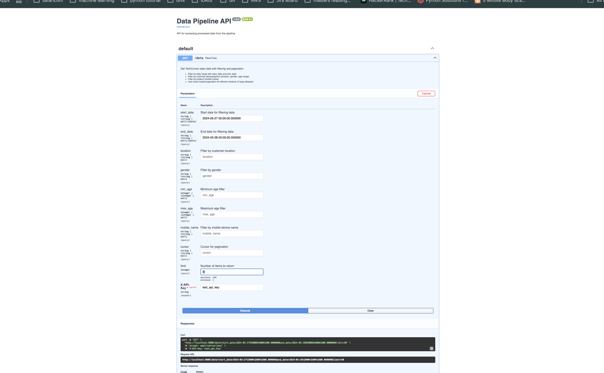

# TechCorner Sales API Documentation

## Overview

This API provides access to processed TechCorner mobile sales data with support for date-based filtering and cursor-based pagination. The API is secured with API key authentication and implements rate limiting to ensure fair usage.

## Base URL

```
http://localhost:8000
```

## Authentication

All API requests require an API key to be included in the `X-API-Key` header:

```
X-API-Key: your_api_key_here
```

For testing purposes, the following API keys are accepted:
- `test_api_key`
- `demo_key`

Example:
```bash
curl -X GET "http://localhost:8000/data" -H "X-API-Key: test_api_key"
```

Requests without a valid API key will receive a `401 Unauthorized` response.

## Rate Limiting

The API implements rate limiting of 100 requests per minute per API key. If you exceed this limit, you will receive a `429 Too Many Requests` response. Please adjust your request rate accordingly.

Rate limits are reset every 60 seconds.

## Endpoints

### GET /data

Retrieve mobile sales data with filtering and cursor-based pagination.

#### Query Parameters

| Parameter  | Type   | Required | Description |
|------------|--------|----------|-------------|
| start_date | String | No       | Filter data from this date (format: YYYY-MM-DD) |
| end_date   | String | No       | Filter data until this date (format: YYYY-MM-DD) |
| location   | String | No       | Filter by customer location (e.g., "Rangamati Sadar") |
| gender     | String | No       | Filter by gender (M or F) |
| min_age    | Integer| No       | Filter by minimum age |
| max_age    | Integer| No       | Filter by maximum age |
| mobile_name| String | No       | Filter by mobile device name (e.g., "iPhone") |
| cursor     | String | No       | Pagination cursor for retrieving the next set of results |
| limit      | Integer| No       | Number of records to return (default: 50, max: 100) |

#### Response Format

```json
{
  "items": [
    {
      "customer_id": 1,
      "date": "2024-05-27 00:00:00.000000",
      "customer_location": "Rangamati Sadar",
      "age": 49,
      "gender": "F",
      "mobile_name": "Galaxy A55 5G 8/128",
      "sell_price": 17073.0,
      "from_facebook": "No",
      "followed_page": "Yes",
      "previous_purchase": "No",
      "heard_of_shop": "Yes",
      "source_file": "TechCorner_Sales_update.csv",
      "processed_at": "2025-03-23 21:55:54.960163",
      "rowid": 1
    },
    // More items...
  ],
  "next_cursor": "51",  // Cursor for the next page, null if no more results
  "total_count": 8871   // Total number of records matching the query
}
```

#### Example Requests

**Basic request (first page of results):**
```bash
curl -X GET "http://localhost:8000/data" -H "X-API-Key: test_api_key"
```

**With date filtering:**
```bash
curl -X GET "http://localhost:8000/data?start_date=2024-05-28&end_date=2024-05-28" -H "X-API-Key: test_api_key"
```

**With location filtering:**
```bash
curl -X GET "http://localhost:8000/data?location=Rangamati%20Sadar" -H "X-API-Key: test_api_key"
```

**With multiple filters:**
```bash
curl -X GET "http://localhost:8000/data?start_date=2024-05-28&location=Rangamati%20Sadar&gender=F" -H "X-API-Key: test_api_key"
```

**With pagination (using cursor from previous response):**
```bash
curl -X GET "http://localhost:8000/data?cursor=50&limit=25" -H "X-API-Key: test_api_key"
```

### GET /health

Health check endpoint for monitoring the API status.

#### Response

```json
{
  "status": "healthy",
  "total_records": 8871,
  "timestamp": "2025-03-23T21:55:54.960163"
}
```

## Pagination

The API uses cursor-based pagination for efficient retrieval of large datasets:

1. Make an initial request without a cursor to get the first page of results
2. In the response, look for the `next_cursor` field
3. If `next_cursor` is not null, use its value in the `cursor` parameter of your next request
4. Repeat until `next_cursor` is null, indicating no more results

Example pagination flow:
```
# Get first page
curl -X GET "http://localhost:8000/data?limit=25" -H "X-API-Key: test_api_key"
# Response contains next_cursor: "26"

# Get second page
curl -X GET "http://localhost:8000/data?cursor=26&limit=25" -H "X-API-Key: test_api_key"
# Response contains next_cursor: "51"

# Get third page
curl -X GET "http://localhost:8000/data?cursor=51&limit=25" -H "X-API-Key: test_api_key"
# And so on...
```

## Error Handling

The API uses standard HTTP status codes to indicate the success or failure of a request:

| Status Code | Description |
|-------------|-------------|
| 200         | Success     |
| 400         | Bad Request - Invalid parameters |
| 401         | Unauthorized - Invalid or missing API key |
| 429         | Too Many Requests - Rate limit exceeded |
| 500         | Internal Server Error - Something went wrong on the server |

Error responses include a JSON body with more details:

```json
{
  "detail": "Error message describing the issue"
}
```

## Data Fields

The API returns the following fields for each record:

| Field              | Type    | Description |
|--------------------|---------|-------------|
| customer_id        | Integer | Unique identifier for the customer |
| date               | String  | Date of the purchase (YYYY-MM-DD) |
| customer_location  | String  | Location of the customer (e.g., "Rangamati Sadar") |
| age                | Integer | Age of the customer |
| gender             | String  | Gender of the customer (M or F) |
| mobile_name        | String  | Name/model of the mobile device purchased |
| sell_price         | Float   | Price of the mobile device |
| from_facebook      | String  | Whether the customer came from Facebook (Yes/No) |
| followed_page      | String  | Whether the customer follows the shop's page (Yes/No) |
| previous_purchase  | String  | Whether the customer made previous purchases (Yes/No) |
| heard_of_shop      | String  | Whether the customer had heard of the shop before (Yes/No) |
| source_file        | String  | Source data file name |
| processed_at       | String  | Timestamp when the record was processed |
| rowid              | Integer | Internal database row identifier (used for pagination) |


Sample API Outputs
For visual reference, sample API outputs are available in the project repository:




These screenshots demonstrate the actual JSON responses from the API and can be helpful for understanding the response format and structure. Refer to these examples when building client applications that consume this API.